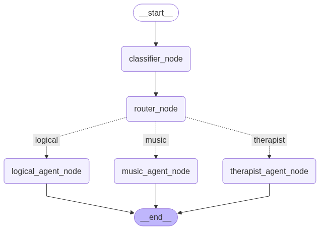
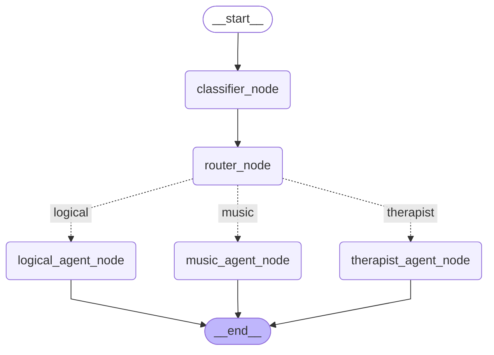

# Mermaid diagram 

```mermaid
---
config:
  flowchart:
    curve: linear
---
graph TD;
	__start__([<p>__start__</p>]):::first
	classifier_node(classifier_node)
	router_node(router_node)
	therapist_agent_node(therapist_agent_node)
	logical_agent_node(logical_agent_node)
	music_agent_node(music_agent_node)
	__end__([<p>__end__</p>]):::last
	__start__ --> classifier_node;
	classifier_node --> router_node;
	router_node -. &nbsp;logical&nbsp; .-> logical_agent_node;
	router_node -. &nbsp;music&nbsp; .-> music_agent_node;
	router_node -. &nbsp;therapist&nbsp; .-> therapist_agent_node;
	logical_agent_node --> __end__;
	music_agent_node --> __end__;
	therapist_agent_node --> __end__;
	classDef default fill:#f2f0ff,line-height:1.2
	classDef first fill-opacity:0
	classDef last fill:#bfb6fc

```
